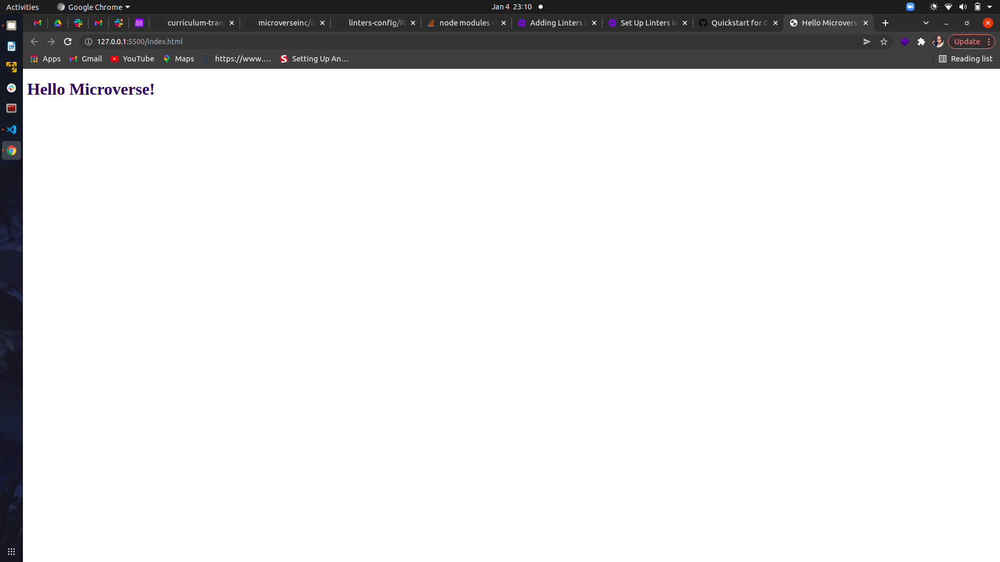

# Project Name

> Using linters

Additional description about the project and its features.

## Built With

- HTML
- CSS
- Linters

Live Demo

[Live Demo Link](https://livedemo.com)

Getting Started

To get a local copy up and running follow these simple example steps.

Prerequisites
You only need a browser

## Authors

👤 **Author1**

- GitHub: [@githubhandle](https://github.com/iLynette)
- Twitter: [@twitterhandle](https://twitter.com/acholah_lynette)
- LinkedIn: [LinkedIn](https://www.linkedin.com/in/lynette-acholah/)

## 🤝 Contributing

Contributions, issues, and feature requests are welcome!

Feel free to check the [issues page](../../issues/).

## Show your support

Give a ⭐️ if you like this project!

## 📝 License

This project is [MIT](./MIT.md) licensed.
